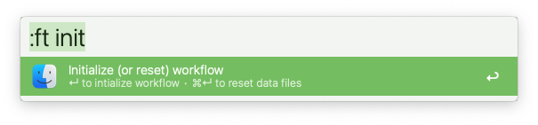
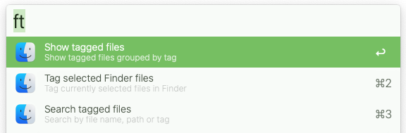
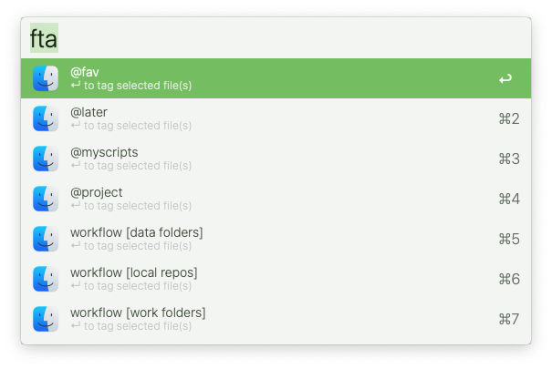
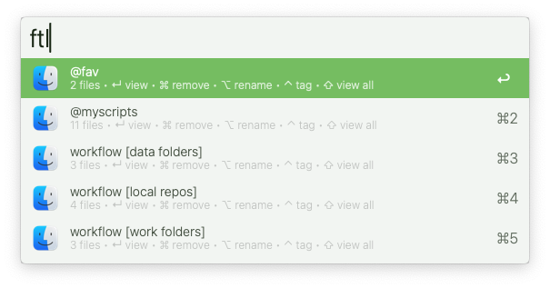
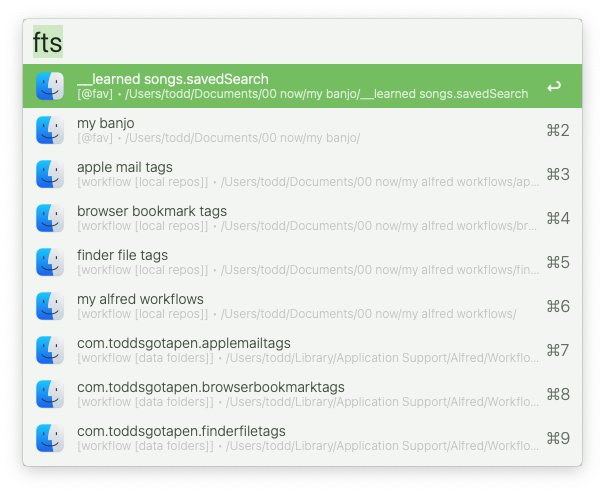
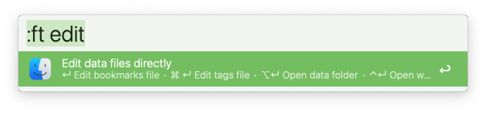

# Finder File Tags

Tag Apple Finder files with a label for easy access

▸  Requires [jq](https://formulae.brew.sh/formula/jq)

Part of a complete tagging system:  [Apple Mail Tags](https://github.com/modrocko/apple-mail-tags-alfred-workflow) | [Browser Bookmark Tags](https://github.com/modrocko/browser-bookmark-tags-alfred-workflow) | [Finder File Tags](https://github.com/modrocko/finder-file-tags-alfred-workflow) | [To-Do Task Tags](https://github.com/modrocko/todo-task-tags-alfred-workflow)

## Usage

Here're the main functions for this workflow

*💡 **Tip**: Type '!' to mark & save tags as '❗' (high priority)*  

### Initialize workflow

❗Type `:ft init` to run this operation to start using this workflow

     

<kbd>↵</kbd> Initialize the workflow

<kbd>⌘</kbd> <kbd>↵</kbd> Reset data files *(will delete current data files)* 

### Show all Mail Tag options

Type `ft` to view top level functions

  

### Assign a tag

Type `fta` to view all tags *(defaults or previously specified tags)*

Select or type a new label to tag currently highlighted files in Apple Finder

 

<kbd>↵</kbd> Tag selected email(s)

### List tagged files

Type `ftl` to view a list of all items grouped by tag

 

<kbd>↵</kbd>  View all files for selected tag

<kbd>⌘</kbd> <kbd>↵</kbd> Remove selected tag from all tagged files

<kbd>⌥</kbd> <kbd>↵</kbd> Rename selected tag for all files

<kbd>⌃</kbd> <kbd>↵</kbd> Tag currently highlighted files for selected tag

<kbd>⇧</kbd> <kbd>↵</kbd> Open all files for the selected tag

### Search tagged emails

Type `fts` to search through all tagged emails

 

<kbd>↵</kbd>  View email for selected item

<kbd>⌘</kbd> <kbd>↵</kbd> Remove tag from selected file

<kbd>⌥</kbd> <kbd>↵</kbd> Open the file and remove tag afterwards

<kbd>⌃</kbd> <kbd>↵</kbd> Reassign tag for selected file

### Apple Mail Tag utilities

Type `:ft edit` to edit data files (if needed) and open underlying folders

 

<kbd>↵</kbd>  Open email file for manual edits via TextEdit.app

<kbd>⌘</kbd> <kbd>↵</kbd> Open default tags file for manual edit via TextEdit.app

<kbd>⌥</kbd> <kbd>↵</kbd> Open the data folder for this workflow

<kbd>⌃</kbd> <kbd>↵</kbd> Open the workflow folder for this workflow
