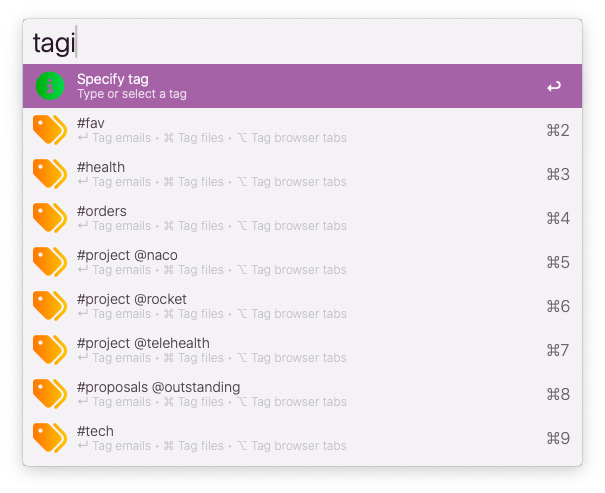

# Tag It!

Tag emails, files, folders & web pages for easy access later on.

A consolidated Alfred system to:  

✓  Keep your projects organized  
✓  Keep your work moving forward  
✓  Keep your brain sane

Works with: Apple Mail ∙ Apple Finder ∙ Chrome-based browsers

▸ Requires [jq](https://formulae.brew.sh/formula/jq)

## Usage

Easy — just press a bunch of the option keys to start saving, finding & viewing emails, files, folders & browser tabs. 

### Main workflows

  

### Initialize workflow

▸ In *Configure Workflow*: Select browser preference ∙ Select tagging preference for browser window(s)

▸ Initialize the workflow to create the underlying data file

 

<kbd>↵</kbd>  Initialize the workflow

<kbd>⌘</kbd><kbd>↵</kbd> Reset data files (destructive action, will delete all existing data)

### Tag something

 

<kbd>↵</kbd>  Tag all selected emails in Apple Mail window

<kbd>⌘</kbd><kbd>↵</kbd> Tag all selected files in front-most Finder window

<kbd>⌥</kbd><kbd>↵</kbd> Tag all browser tabs as per preference setting

### Show tagged items

 

<kbd>↵</kbd>  View list of item types for this tag (emails, files & tabs)

<kbd>⌘</kbd><kbd>↵</kbd> Rename this tag

<kbd>⌥</kbd><kbd>↵</kbd> Remove this tag & all its tagged items

<kbd>⌃</kbd><kbd>↵</kbd> View flat list all items for this tag

### Search tagged items

<kbd>↵</kbd>  

<kbd>⌘</kbd><kbd>↵</kbd> 

<kbd>⌥</kbd><kbd>↵</kbd> 

<kbd>⌃</kbd><kbd>↵</kbd> 

<kbd>⇧</kbd><kbd>↵</kbd> 

