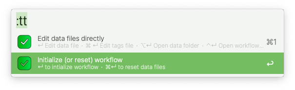
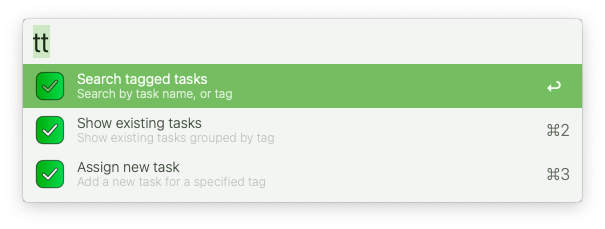
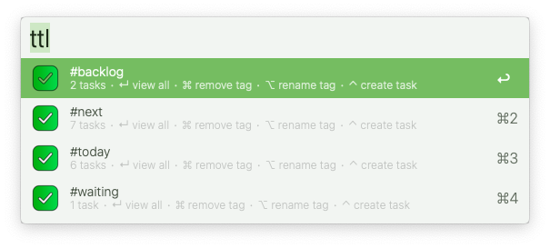
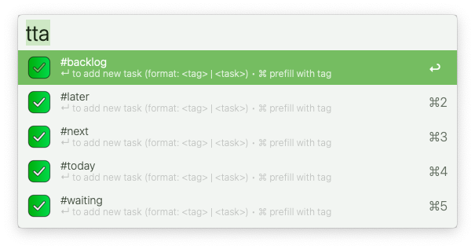
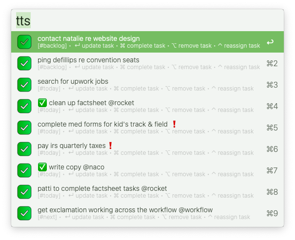
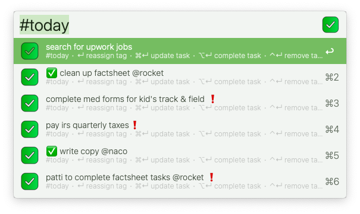

# To-Do Task Tags

Tag, search & manage tasks directly in Alfred using simple keystrokes.

Part of a complete tagging system:  [Apple Mail Tags](https://github.com/modrocko/apple-mail-tags-alfred-workflow) | [Browser Bookmark Tags](https://github.com/modrocko/browser-bookmark-tags-alfred-workflow) | [Finder File Tags](https://github.com/modrocko/finder-file-tags-alfred-workflow) | [To-Do Task Tags](https://github.com/modrocko/todo-task-tags-alfred-workflow)

▸  Requires [jq](https://formulae.brew.sh/formula/jq)

## Usage

Here're the main functions for this workflow

*💡 **Tip**: Type '!' to mark & save tags as '❗' (high priority)*  

### Initialize workflow

Initialize workflow before using workflow

  

### View menu

Show all top-level functions

   

### View all tags
Show all existing task tags and let user act on them  

  

<kbd>↵</kbd> View all tasks for selected tag  

<kbd>⌘</kbd><kbd>↵</kbd> Remove tag  

<kbd>⌥</kbd><kbd>↵</kbd> Rename tag  

<kbd>⌃</kbd><kbd>↵</kbd> Create task  

<kbd>⇧</kbd><kbd>↵</kbd> View all tasks for selected tag  

### Assign task to tag

Pick or create a tag before adding a task  

    

<kbd>↵</kbd> To add new task (format: <tag> | <task>)  

<kbd>⌘</kbd><kbd>↵</kbd> To prefill with tag  

### Search all tasks

Search tasks by tag or task text and take action  

   

<kbd>↵</kbd> Update task  

<kbd>⌘</kbd><kbd>↵</kbd> Mark as completed  

<kbd>⌥</kbd><kbd>↵</kbd> Remove task  

<kbd>⌃</kbd><kbd>↵</kbd> Reassign tag  

### View tasks by tag
Show all tasks under a specific tag  

   

<kbd>↵</kbd> Update task  

<kbd>⌘</kbd><kbd>↵</kbd> Mark as completed  

<kbd>⌥</kbd><kbd>↵</kbd> Remove task  

<kbd>⌃</kbd><kbd>↵</kbd> Reassign tag  

